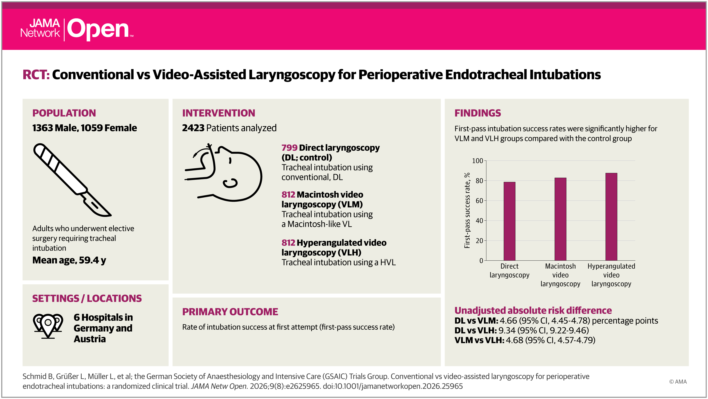
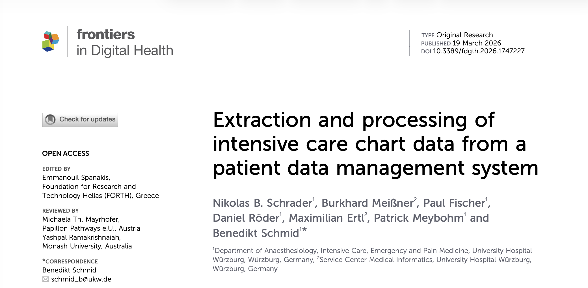

## Research Highlights

::: {#research-highlights layout-ncol=2}

::: {.highlight-card}
{width=100%}
**Conventional vs Video-Assisted Laryngoscopy for Perioperative Endotracheal Intubations: A Randomized Clinical Trial.**  
This randomized trial demonstrated that video laryngoscopy significantly improves first-pass success rates for routine tracheal intubation compared to direct laryngoscopy. These findings support adopting video laryngoscopy as a new standard of care for routine airway management.
[View Publication](https://doi.org/10.1001/jamanetworkopen.2026.25965){target="_blank"}
:::

::: {.highlight-card}
{width=100%}
**Extraction and processing of intensive care chart data from a patient data management system.**  
This modular ETL framework streamlines the extraction of high-frequency, multimodal data from patient management systems while ensuring strict regulatory compliance. By integrating automated de-identification and auditable workflows, it provides a reproducible foundation for secondary clinical research in intensive care settings.  
[View Publication](https://doi.org/0.3389/fdgth.2026.1747227){target="_blank"}
:::

:::